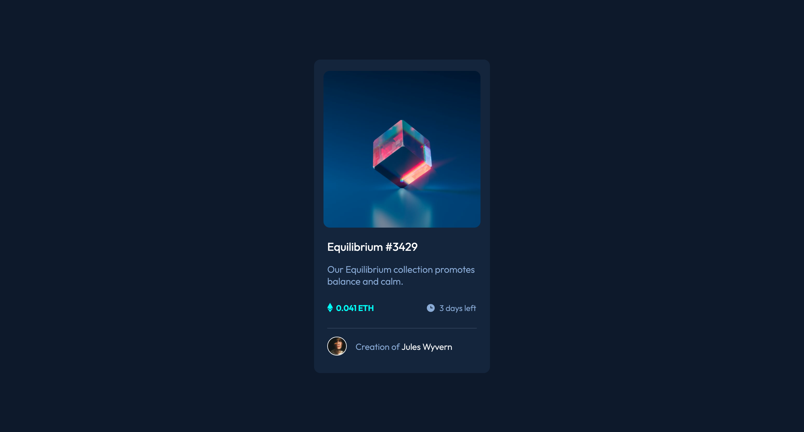

# Frontend Mentor - NFT preview card component solution

This is a solution to the [NFT preview card component challenge on Frontend Mentor](https://www.frontendmentor.io/challenges/nft-preview-card-component-SbdUL_w0U). Frontend Mentor challenges help you improve your coding skills by building realistic projects. 

## Table of contents

- [Overview](#overview)
    - [Screenshot](#screenshot)
    - [Links](#links)
- [My process](#my-process)
    - [Built with](#built-with)
    - [What I learned](#what-i-learned)
    - [Continued development](#continued-development)
    - [Useful resources](#useful-resources)
- [Author](#author)
- [Acknowledgments](#acknowledgments)


## Overview 

I enjoyed creating this site. I look forward to taking on more difficult challenges. :D

### Screenshot



### Links

- Live Site URL: [Live site](https://cheytes.github.io/nft-preview-card/)


## My Process

### Built with

- HTML markup
- CSS custom properties
- Flexbox
- Desktop-first workflow

### What I learned 

This challenge introduced me to many cool, yet small things but my favorite are:

- Centering elements

```css
.flex-on-em {
    display: flex;
    justify-content: center; /* horizontally aligned */
    align-items: center; /* vertically aligned */
}

.marg {
    margin: 0 auto;
}
```

- Height of the browser 

```css
.widee {
    height: 100vh;
}
```

### Continued development 

Working with the svg was a bit challenging, so i'll work on that area in future projects. 

### Useful resources 

- [Flexbox froggy](https://flexboxfroggy.com/) - this helped me with centering my card. 

## Author

- Frontend Mentor - [@cheytes](https://www.frontendmentor.io/profile/cheytes)
- Twitter - [@chey_yte](https://twitter.com/chey_yte)

## Acknowledgments

I'd like to thank my lecturer for helping me with the hover. I learnt a great deal from her.